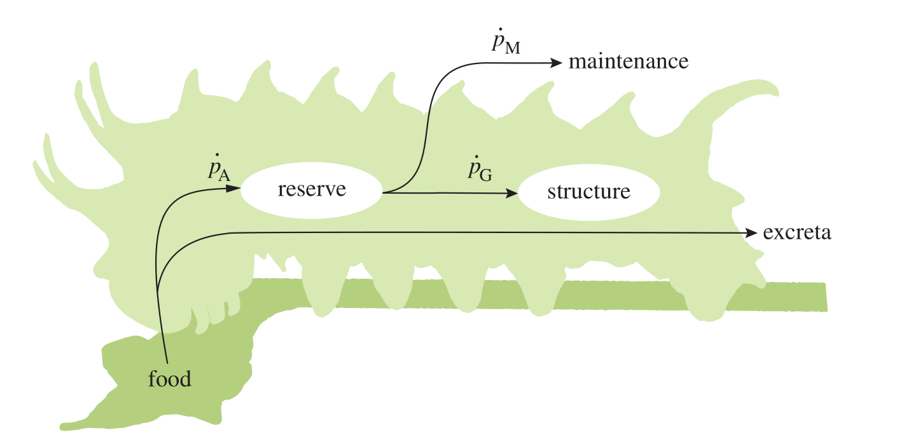

```{r setup, include=FALSE}
knitr::opts_chunk$set(echo = TRUE)
library(deSolve)
```

# Background
What I want to do in the following is introduce Dynamic Energy Budget (DEB) theory, what it does, and how it may be useful in ecology. After that, we will set up some basic DEB growth equations in the form of ordinary differential equations (ODEs). 

But firstly, why are individual energy budgets important.... let alone dynamic ones?

Conservation of energy (and mass) constrains all life processes from the molecular to the ecosystem. Identifying further constraints on the flow of energy through ecosystems has ramifications across all fields of biology. Ingregration accross different levels of biological organisation (which span vast scales of space and time) is one of the grand challenges in the life sciences. Energy - viewed as a universal currency of life processes - may offer a way forward here. A focus on the energy budgets of individuals is of particular interest because at this level of organisational complexity it is relatively easy to make energy and mass balances (compared with the sub- and supra-individual levels). Individuals are also the units of selection, and the survival machines of life.

DEB theory's creator, Bas Kooijman, describes it as the following:

>"The Dynamic Energy Budget (DEB) theory unifies the commonalities between organisms as prescribed by the implications of energetics, which links different levels of biological organisation (cells, organisms and populations). The theory presents simple mechanistic rules that describe the uptake and use of energy and nutrients (substrates, food, light) and the consequences for physiological organisation throughout an organism's life cycle, including the relationships of energetics with aging and effects of toxicants. All living organisms are covered in a single quantitative framework, the predictions of which are tested against a wide variety of experimental results at the various levels of biological organisation. The theory explains many general observations, such as the body size scaling relationships of certain physiological traits, and provides a theoretical underpinning to the widely used method of indirect calorimetry."  [http://www.bio.vu.nl/thb/deb/index.html]

So what are these "commonalities between organisms as prescribed by the implications of energetics"?



Let's do some DEB theory! First, we set values for some of the core DEB parameters, which we have hopefully discussed. If not, do so now...

```{r}
# initial vars
V0 = 0.01 # intial structure, cm^3

# set parameters
p_Am =  100   # SA specific assimilation rate, J/cm^2/d
E_G   = 28   # cost of growth, J/cm^3
v     = 0.02 # conductance, cm/d
p_M   = 18   # vol. specific maintenance rate, J/cm^3/d
f     = 1    # scaled functional response of feeding, -
```


# Setting up the ODEs
We are using the differential equation solver function `ode()` in the R package `deSolve::`. This function takes four necessary arguments: 

`y`:	the initial (state) values for the ODE system, a vector. If y has a name attribute, the names will be used to label the output matrix.

`times`: time sequence for which output is wanted; the first value of times must be the initial time.

`func`: either an R-function that computes the values of the derivatives in the ODE system (the model definition) at time t, or a character string giving the name of a compiled function in a dynamically loaded shared library.
The return value of func should be a list, whose first element is a vector containing the derivatives of y with respect to time, and whose next elements are global values that are required at each point in times. The derivatives must be specified in the same order as the state variables y.

`parms`: parameters passed to func.

### 1. Initialise state variables
```{r}
state <- c(res = f*p_Am/v*V0, # initial reserve, J
           V   = V0)          # initial structure, cm^3
```

### 2. Set integration time points
```{r}
times <- seq(0,5000,length = 1000) # time, d
```

### 3. Create function containing ODEs
```{r}
growth<-function(t, state, pars) {
  # parameters
  p_Am= pars[1] # SA specific assimilation rate, J/cm^2/d
  E_G = pars[2] # cost of growth, J/cm^3
  v   = pars[3] # conductance, cm/d
  p_M = pars[4] # vol. specific maintenance rate, J/cm^3/d
  f   = pars[5] # scaled functional response of feeding, -
   
  
  # state variables
  res = state[1] # reserve, J
  V   = state[2] # structure, cm^3
  
  # rate of change
  dres = f*p_Am*V^(2/3) - res* (E_G*v/V^(1/3) + p_M)/(res/V + E_G);
  dV   = (res*v/V^(1/3) - p_M*V)/(res/V + E_G);
  
  # return the rate of change
  list(c(dres, dV))
}
```

### 4. Wrap parameters to pass to function
```{r}
pars       <- c(p_Am  = p_Am, # SA specific assimilation rate, J/cm^2/d
                E_G   = E_G,  # cost of growth, J/cm^3
                v     = v,    # conductance, cm/d
                p_M   = p_M,  # vol. specific maintenance rate, J/cm^3/d
                f     = f)    # scaled functional response of feeding, -
```

## Solve ODEs
Now it is a simple matter of running the function.
```{r}
resV <- ode(y = state, times = times, func = growth, parms = pars)

```

# Plot results
Here we plot the output of the state variables reserve and structure through time. These state variables determine the state of the system, irrespective of how we got there. From these state variables we can calculate a range of other biological variables, such as total biomass, assimmilation rate, growth rate, mainentance rate, etc. Importantantly, this may be data we actaully have measured on species and how we go about fitting a DEB model to data. In this example we only looked at the non-reproductive growth phase, but the standard DEB model also includes embryonic, and reproductive phases, for the cost of only a few more parameters $\kappa$, $\dot{k_J}$, $E_{Hb}$, $E_{Hj}$. 
```{r}
plot(times, resV[,3],'l', xlab = 'time, d', ylab = expression(structure*","~ cm^3))
plot(times, resV[,2]/resV[,3],'l', xlab = 'time, d', ylab = expression(reserve/structure*","~J/cm^3))
```

## Mathematical overkill? 
So far it may seem like DEB theory is a complex presentation of the von Bertalanffy growth curve, which has the simple analytical solution:

$$V = V_\infty(1-(1-V_0^{1/3}/V_\infty^{1/3})e^{-at})^3$$

Indeed, plotting the analytical solution (black line) over the numerical solution (red circles) shows they are equivilent.


```{r}
V_inf = (p_Am/p_M)^3
a<-1/(3/p_M/E_G + 3*V_inf^(1/3)/v)

plot(times, V_inf*(1-(1-V0^(1/3)/V_inf^(1/3))*exp(-a*times))^3, 'l', ylab = expression(V*','~cm^3));points(resV[seq(1,length(times),100),1],  resV[seq(1,length(times),100),3], col = 'red')
```

But the ODE method also offers a simple solution to non-steady state conditions, such as non-constant food or temperature.

For example, say that food availability varied throught time as:

```{r}
plot(times,(0.1*sin(times*2*pi/365)+0.8), 'l', ylab = 'feeding response, -', main = 'f = 0.1*sin(times*2*pi/365)+0.8')
```

In this example you could probably use some fancy calculus to find another analytical solution, but it is straight forward to solve numerically after modifying the growth equation to capture the variance in food conditions.

```{r}
growth2<-function(t, state, pars) {
  # parameters
  p_Am= pars[1]
  E_G = pars[2]
  v   = pars[3]
  p_M = pars[4]
  f   = (0.1*sin(t*2*pi/365)+0.8) # change the functional response.
  
  # state variables
  res = state[1]
  V   = state[2]
  
  # rate of change
  dres = f*p_Am*V^(2/3) - res* (E_G*v/V^(1/3) + p_M)/(res/V + E_G);
  dV   = (res*v/V^(1/3) - p_M*V)/(res/V + E_G);
  
  # return the rate of change
  list(c(dres, dV))
}
```


Solve ODEs for varying food
```{r}
resV2 <- ode(y = state, times = times, func = growth2, parms = pars)

```

Plot results for varying food
```{r}
plot(times, resV2[,3],'l', col = 'red', ylim =c(0,200), xlab = 'time, d', ylab = expression(structure*","~ cm^3));lines(times, resV[,3])
plot(times, resV2[,2]/resV2[,3],'l', col = 'red', xlab = 'time, d', ylab = expression(reserve/structure*","~J/cm^3));lines(times, resV[,2]/resV[,3])
```

A key achievement of DEB theory is the insight into the mechanistic basis of well known growth curves, and their extension to non-steady state conditions and other life-history stages. It can help to explain indirect calorimetry (energy expenditure from gas exchange), and contraints on energy flows within and between species. It potentially serves as a framework for the quantitative intrepretation of the life-histories, metabolic architecture, and energy budgets of diverse species in terms of variance in their parameter values. 
